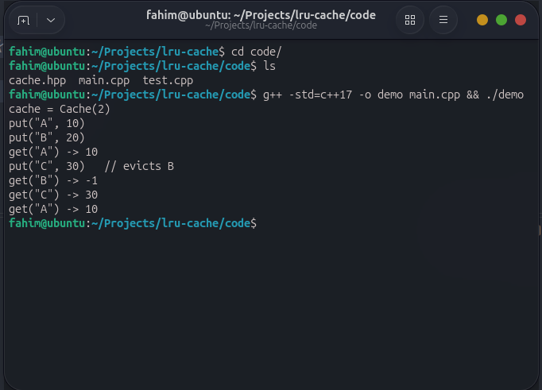

# LRU Cache in C++

This is my solution to the LRU Cache task. The cache holds a fixed number of items. When it is full and a new item comes in, it removes the item that was used the longest time ago.

It supports three things:

- `Cache(capacity)` creates the cache. The capacity must be positive, otherwise it throws an error.
- `get(key)` returns the value, or `-1` if the key is not there. A successful `get` makes that key the most recently used.
- `put(key, value)` adds a key or updates an existing one, and makes it the most recently used. If the cache is full, the least recently used item is removed first.

## How it works

I used two STL containers together:

- **`std::list`** keeps the items in order of use. The front is the most recently used item and the back is the least recently used. A list can move an item to the front without shifting anything else, so it is fast.
- **`std::unordered_map`** maps each key to its place in the list. This lets me find any item right away without looping through the list.

I needed both. The map is fast at finding a key but has no order. The list keeps the order but is slow at finding a key. Together, both operations are fast.

What happens on each call:

- `get`: if the key exists, move it to the front of the list and return its value.
- `put` with an existing key: update the value and move it to the front.
- `put` with a new key: if the cache is full, remove the last item in the list (and its map entry), then add the new item to the front.

Example with capacity 2:

```
put("A", 10)   list: A
put("B", 20)   list: B, A
get("A")       list: A, B     (A moved to the front)
put("C", 30)   full, so B is removed. list: C, A
get("B")       -1             (B is gone)
```

## Complexity

- **Time:** `get` and `put` are both O(1) on average (one map lookup plus a constant-time list operation).
- **Space:** O(capacity), because the cache never stores more than `capacity` items.

## Project structure

```
lru-cache/
  code/
    cache.hpp             Cache class
    main.cpp              Runs the example from the task
    test.cpp              Tests
  screenshot/
    DemoOutput.png        Real output of the demo
  README.md
  AI_PROMPT_HISTORY.txt   My AI prompt history
```

## How to run

You need `g++` with C++17. Start from the project root and go into the code folder:

```bash
cd code
```

Run the example:

```bash
g++ -std=c++17 -o demo main.cpp && ./demo
```

It prints:

```
cache = Cache(2)
put("A", 10)
put("B", 20)
get("A") -> 10
put("C", 30)   // evicts B
get("B") -> -1
get("C") -> 30
get("A") -> 10
```

Run the tests:

```bash
g++ -std=c++17 -o test test.cpp && ./test
```

It prints `All tests passed`.

## Output screenshot

This is the real output from running the demo:



## What the tests cover

- The example from the task
- Updating a key changes its value and makes it the most recent
- Capacity of 1
- Getting a key that does not exist
- Creating a cache with capacity 0 throws an error

## Limitations

- Keys are strings and values are integers.
- It is not thread-safe.
- If a program reads a huge number of different keys once, they push out the items that were actually used often.
- I did not implement the optional TTL (expiration) bonus.

## AI usage

I used AI while working on this task. The full prompt history is in `AI_PROMPT_HISTORY.txt`.